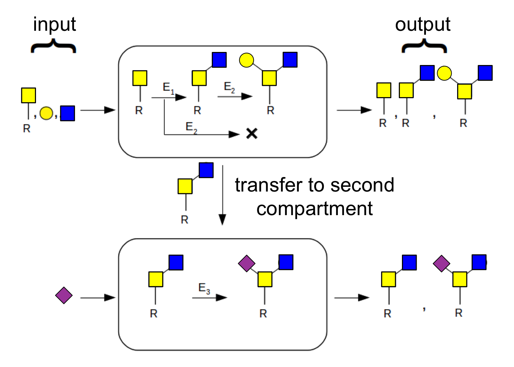

# GLYSYNTH

Glycans are tree-like polymers made up of sugar monomer building blocks which are found on the surface of all living cells.
Proteins called GTase enzymes assemble glycans via the successive addition ofmonomer building blocks. 
The rules by which the enzymes operate are not fully understood.
This tool is the first SMT-solver-based iterative method that infers the assembly process of the glycans by analyzing the set of glycans from a cell.
 

## Installation

clone the repository and run:
```sh
make
```
## Running an experiment
The file containing the input parameters is to be found in examples/
- Set the value of number-of-rules-to-learn, max-rule-depth, max-compartments appropriately
- List all the sugar monomers involved in the molecules on each line. For example, if A is a sugar monomer with arity 2:
```sh
(sugar A 2)
```
- Set the roots of the molecules in the parameter seed-mol
- List all the molecules in your glycan set each on a separate line. For example, look at [examples/ex1.sugar](examples/ex1.sugar)
- Run the following command and find the rules, negative rules:
```sh
./vts-synth -r -i examples/ex1.sugar 
```
- For each rule, ':' represents fast reaction, '::' represents slow, and the number in the beginnning indicates compartment. '_' indicates soft end 
and '<' indicates hard end.